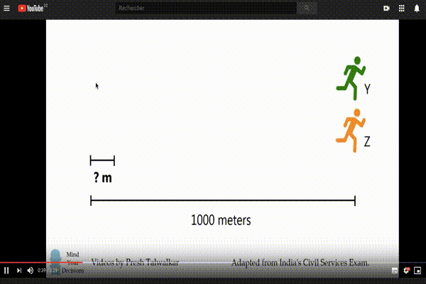
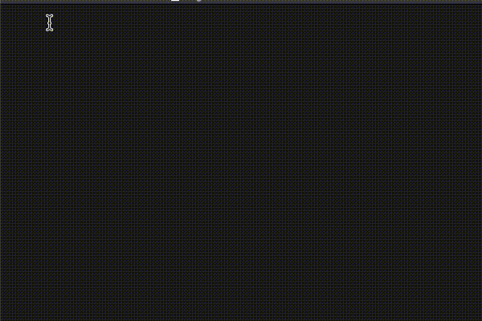

# Youtube-OCR
This is a chrome extension, that uses Tesseract.js to recognize text from video.

The recognized text is automatically copied to clipboard

For now, it is not trained on any additional data
If it's clear and a wellknown font, it would recognize it without problems
If the frame has a lot of variation (textures, shapes, different contrasty objects) it would  most likely return random symbols.
It's recommended to use the highest resolution possible for now.

### How to Use it:
 - Select the desired portion of the video, press and hold the mouse button, and drag over the text until you cover the whole section.
 - Press Alt + Ctrl to start the recognition (this is temporary)
 - Wait a little, until the recognised text gets shown to the right side of the cursor.
 - It should to automatically copied to the clipboard (do it again if it is not).
 - Hit directly Alt + Ctrl on a freshly loaded page to recognize the entire video frame (takes time, not recommended).

#### Alt+Ctrl

Figure 1 video: [_Three Runners Puzzle_](https://www.youtube.com/watch?v=C6emQS14Tbk) is from YouTube channel: [**MindYourDecisions**](https://www.youtube.com/channel/UCHnj59g7jezwTy5GeL8EA_g).

### Installation
- Go to: chrome://extensions/
- Activate developper mode
- Click on LOAD UNPACKED
- Go to the cloned/downloaded repository
- click SELECT

#### some problems:
    When video is not opened in a new tab, or is not refreshed, it does not load the app, that is because there is no video in the main page, and the extention does not refrech if you access a link from the same tab.
    You either have to open in a new tab, or just refresh it.
    Similarly, if you get back to main youtube page from a video page, the app would still continue to run. (same cause, same solution).
    
##### Next step:
    - dynamically change the canvas size according to the video (now, you refrech)
    - train the model on more fonts and styles
    
This project is using tesseract.js version from https://github.com/naptha/tesseract.js
